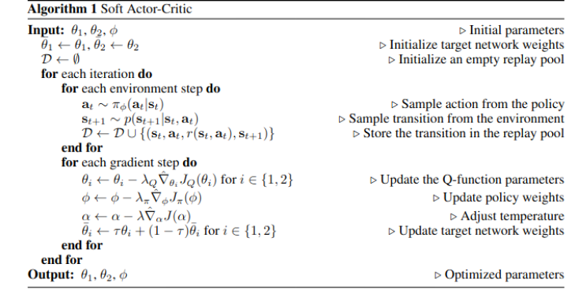
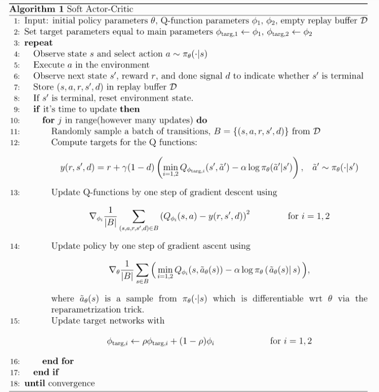
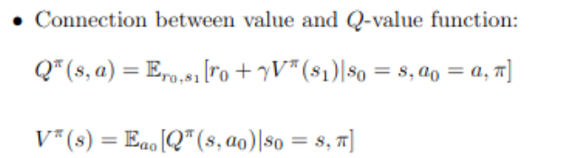
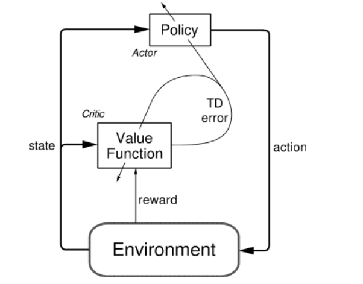
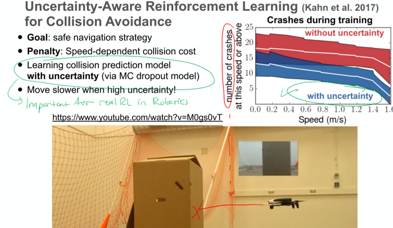

## 22-11-05 Team 9

### TODO

- [X] Read Learning by Play
- [X] This is already a lot of work. Check out the open ai
[https://spinningup.openai.com/en/latest/](https://spinningup.openai.com/en/latest/)
- [X] as well as[ https://stable-baselines3.readthedocs.io/en/master/](https://stable-baselines3.readthedocs.io/en/master/). 
Here you will find some implementations of SAC which you can use as your starting point for implementing the Meta-RL and/or SAC-X algorithm. In case you use open-source code, please make sure that you cite it properly and mark your own contribution in your implementation visible

## 22-11-07 Felix
### Questions
- [X]  Cite the uploaded code on github! And change our curent one, HOW?
    - [X]  Write citing it in the report basically at the end 
    - [X] With bibtex info …
- [X] Questions to understand the papers
    - [X] Next week again
- [X]  Is the presentation on 15th online?
    - [X] Yes it is online!
    - [X] Have stable internet
- [X] Presentation is a week before report
- [X] FINAL REPORT Mid February
- [X] Continious action space??
    - [X] 4 values basically for direction and velocity
    - [X] We can try to let NN predict the right amount of speed
    - [X] Maybe use normalized so that the NN learns the scaling anyway
    - [X] We may have to filter the outputs, as the smoothed result from policy might be in the wrong direction with wrong direction in exploration
- [X] Use GYM Box Car Racing as a use case for the generally trained RL we have at the end, start with your own 2D box with Maybe for navigation in autonomous driving do it a the end

### TO DO
- [X] Start with Gym Custom Env / Car Racing + stable baselines SAC
- [X] Implement SAC on your own, as sometimes with this stable baseline/spinning up its already the comes with the fixed API
    - [ ] Think of the already implemented version as plan B
- [X] Use GYM Box Car Racing as a use case for the generally trained RL we have at the end, start with your own 2D box with Maybe for navigation in autonomous driving do it a the end
- [X] Google Coupon Activation in Mail

## 22-11-09 Team 9
### TO DO
- [X] Make the grid bigger
    - [X] No discretized action space just values v_x, v_y later
- [ ] Start with no traj prediction,
    - [ ] Trajectory length later
- [ ] Obstacles:
    - [ ] Add obstacles in env, where ever the “agent is”
    - [ ] Collision detector in the env reward func
        - [ ] Dot product of agent_traj_grid * environment_traj_grid for 1 step
            - [ ] Possible improvement: Eg. if 1 step is 10 pixel movement only occupy pixel 6-10 for all agents as “prediction”
    - [ ] OR for cont. Space only look at distance and size	
    - [ ] Add the obstacle info NN	
- [X] V: Add notes to Git-hub as issues?
- [X] Change DQN of the examlpe code with an easy SAC (find an easier example and adapt to grid_planning)
    - From [SAC paper](https://arxiv.org/pdf/1812.05905.pdf) 
    - 
    - From [Spinning Up](https://spinningup.openai.com/en/latest/algorithms/sac.html#pseudocode) 
    - 
    - From ADLR Lecture: Value - Q Func. Connection
    - 
    - [Actor critic architecture]((http://incompleteideas.net/book/first/ebook/node66.html))
    - 
  

## 22-11-14 Felix

- [ ] SAC-X Paper Qs 
- [ ] Continuous action space?? OR Bigger Grid
    - [ ] 4 values basically for direction and velocity
    - [ ] We can try to let NN predict the right amount of speed
    - [ ] Maybe use normalized so that the NN learns the scaling anyway
    - [ ] We may have to filter the outputs, as the smoothed result from policy might be in the wrong direction with wrong direction in exploration
- [ ]  Exam date?
- [ ]  Google Coupon Activation Code from Felix
- Current model: Potential Field MP
- [ ]  Our example algo.
    - [ ]  Reparam noise?
    - [ ]  Value loss 0.5??
- [ ]  Desining the reward function
    - [ ]  Value comparison of goal and collision
        - [ ]  10/-1 is this normal behavior for RL 
- [ ]  SAC 
    - [ ]  algo depends too much on reward?
    - [ ]  why 2 critic networks
- [ ] Ideas
    - [ ] pretraining the actor network with a search algo like A* or Dijkstra

## Notes for 
### Code
* [Spinning Up in Deep RL!](https://spinningup.openai.com/en/latest/)
* [Stable Baselines3](https://stable-baselines3.readthedocs.io/en/master/) 

### Report 
- [ ]  Write citing it in the report basically at the end, With bibtex info …

### Midterm 15th December
- [ ]  Have a running model

### Endterm 
- [ ]  Presentation is a week before report
- [ ]  FINAL REPORT Mid February

### Future Work
- [ ]  Add to Future work in report:
      - 